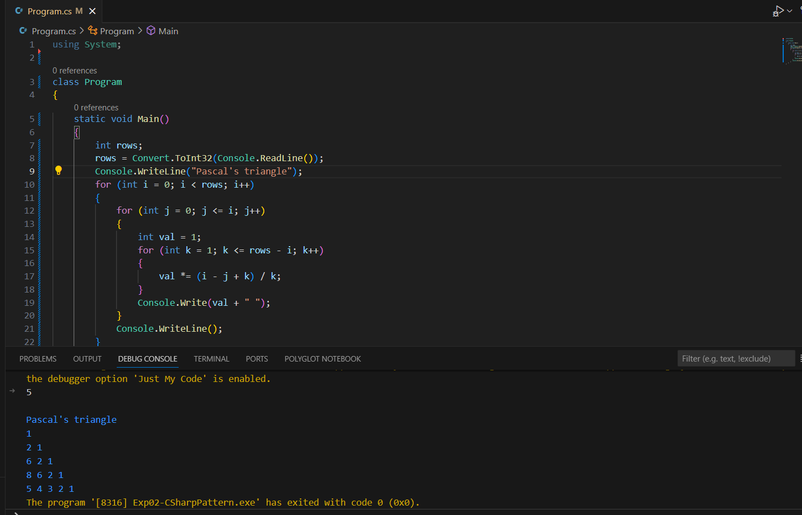

# Exp02-CSharpPattern

## Aim:
To write the C# program to print Pascal's triangle.
## Algorithm:

### Step1:
Initialize the neccessary attributes
### Step2:
Get the no. of rows from the user.
### Step3:
Using for loop print the rows, columns and spaces at required places.
### Step4:
Apply if condition to print 1.
### Step5:
If the condition fails, print the number using the formula. value=value*(i-j+1)/j.
## Program:
```
using System;

class Program
{
    static void Main()
    {
        int rows;
        rows = Convert.ToInt32(Console.ReadLine());
        Console.WriteLine("Pascal's triangle"); 
        for (int i = 0; i < rows; i++)
        {
            for (int j = 0; j <= i; j++)
            {
                int val = 1;
                for (int k = 1; k <= rows - i; k++)
                {
                    val *= (i - j + k) / k;
                }
                Console.Write(val + " ");
            }
            Console.WriteLine();
        }
    }
}
```
## Output:

## Result:
Hence, a C# program for a pascal's triangle is executed successfully.